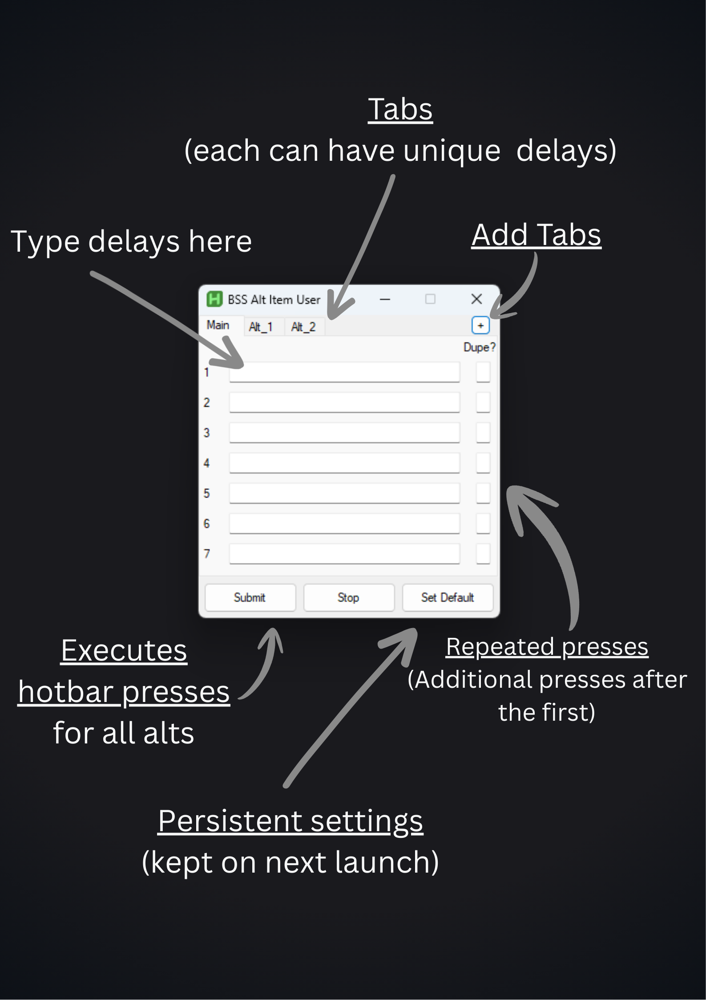

# Boost Macros

A macro that allows you to start using items on alt accounts. Instant stop when the boost is done, personalized defaults per account and millisecond-accurate delays that accurately use items on your main and alts without tab switching and reconfigureing, allowing boosting to be a simple 1 click process.
This macro was designed to be used with other existing macros such as Revoltion macro to take advantage of its AI gather to be more efficient, while handling automatic item usage seperately.

## Interface Overview

How to install the macro:

0. Download AHK if its not installed already.
1. Download the file and extract the zip.
2. Open the folder named 'Submacros' and launch 'MacroCommInput.ahk'
3. Once the macro has been started, it will start creating the necessary files for it to work.
4. Once the messages have all disappeared, there will be a text box with info, close the text box after it has been read.

 	i. The macro will now attempt to copy files to all desktops however there is a chance of failure.

 	ii. In the event of this part of the setup failing, it will open file explorer and the user has to copy 'MacroCommListener.ahk' into 'Public Desktop' (There is no way to automatically do this unfortunately.)

5. Once this is done, open a accounts that are connected via RDC that you want set up, such as FuzzyAltAccount.
6. Launch the .ahk called 'MacroCommListener.ahk' that is found on that accounts desktop, FuzzyAltAccount in this example.
7. Select which file it should read from.
8. Setup complete! Use 'MacroCommListener.ahk' as the input for the listener, more detailed information below.

BoostMacro2.ahk currently automatically uses glitter after 15 minutes once '6' is pressed to refresh 4x and automatically presses '4' twice after the inital press to get star saw ready. When 'k' is pressed the macro will automatically press '5' every 3 minutes for cloud vials and press '1' every 30 seconds for jelly beans. There is currently no way to change the keybinds or delays other than in the program itself. The delays are slightly larger than what is described in this macro to account for any lag or desync between the macro and game.  (Will eventually be replaced by 'MacroCommInput.ahk')

MacroCommListener.ahk currently is needed to be active on all local accounts that the user wants to use items on.
The macro reads the text file in '\\Users\\Public\\AltItemUser' and interprets the information to automatically press the buttons needed.
When setting up, MacroCommListener is copied to \\Public\\Public Desktop meaning it will appear on all local desktops, when launched from the local desktop it creates a copy to the active desktop and is used from then on.

MacroCommInput.ahk currently is the program that sets up these macros and creates a GUI that allows for the user to input certain values which allows for alt accounts to use items in their hotbar at certain delays, similar to the automatic jelly beans and cloud vials of BoostMacro2.
The macro writes the information inputted through the GUI onto a text file in the '\\Users\\Public\\AltItemUser' folder which allows all local accounts to read it. There are 3 buttons in the macro: Submit, Stop and Set Default.
The 'Submit' button submits the information from the GUI into the text file to be interpreted. The 'Stop' button sets all of timer values to 0, this nearly instantly stops the listener from using more items. The Set Default button uses the inputted values of the inputs and writes them to a text file. Upon launch, the text file is read and the default values are already inputted into the GUI.
The GUI now includes multiple tabs that write to their own text file. This allows for better control over what account should perform with what delays.

All the delay values are in milliseconds.
The delays should be slightly larger than what you want to account for any lag or desync between the game and macro, usually about 1 second or 1000 milliseconds extra.

Not tested on other OS other than Win 11

Not associated with Revolution macro

Created by susalmon,
Official download is exclusively on GitHub.

